# Project Gutenberg Word-Frequency Analyzer
**Author:** Karen R. Christie  
**Developed:** November–December 2025  
**Documentation Written:** May 2026

## Description
This Python application provides a robust system for the automated retrieval and word frequency analysis of Project Gutenberg texts, with relational storage of the books, authors, and word frequencies. It specifically targets books focusing on biological sciences, via the Project Gutenberg [Science - Biology](https://www.gutenberg.org/ebooks/bookshelf/669) category.

### Key Features:
* **Dynamic Web Retrieval:** Utilizes a custom `HTMLParser` subclass and the `requests` library to fetch live texts, stripping Gutenberg-specific headers and footers to isolate the core content.
* **Relational Persistence:** Implements a normalized **SQLite3** database using a `bookAuthors` junction table to manage many-to-many relationships between books and multiple authors, ensuring data integrity and reducing redundancy.
* **Scientific Curation Utility:** Includes a specialized CLI tool for iterative "noise" reduction, allowing for the manual refinement of `stopwords.txt` to improve retrieval of words that are biologically significant for a given text.
* **Decoupled Architecture:** Built with a strict separation of concerns, keeping the data processing logic entirely independent of the Tkinter graphical interface.
* **Custom Graphical Interface:** Features a beautiful custom **Tkinter-based GUI** with a unified green color scheme, real-time progress log, dynamic search results, and integrated state management.
* **Plain-Text Metadata Extraction:** Utilizes basic string manipulation to isolate the Title and **regular expressions** to extract the Author block from predictable plain-text Gutenberg headers.

---

## Technical Skills Demonstrated
* **Software Architecture:** Implemented a **decoupled multi-tier architecture** with strict separation of concerns between the Tkinter UI, SQLite persistence layer, and text-processing logic.
* **Data Engineering & ETL:** Developed an end-to-end pipeline including automated HTTP retrieval, **Regex-based metadata extraction**, and a custom `HTMLParser` tokenizer for transforming raw web data into structured relational records.
* **Relational Data Modeling:** Designed and implemented a **normalized SQLite3 schema** featuring a Many-to-Many (M:N) junction table and **Composite Primary Keys** to maintain bibliographic integrity for multi-author works.
* **Linguistic Curation & NLP:** Applied **Natural Language Processing (NLP)** techniques, including stopword filtering and frequency distribution analysis, to improve signal-to-noise ratios in scientific texts.
* **Development Tooling:** Created a dedicated CLI utility for **iterative data cleaning**, enabling the curation of domain-specific stopword lists to handle technical "noise" in biological literature.

---

## Dependencies

### External Libraries
These packages are required for web connectivity and the graphical interface. They must be installed via pip:
* **`requests`**: Handles HTTP/HTTPS requests for downloading Gutenberg texts.
* **`customtkinter`**: Provides the modern visual components and "Green" themed GUI.
* **`packaging`**: A dependency of `customtkinter` used for internal version handling.

### Python Standard Libraries
The following modules are built into Python and do not require separate installation:
* **`sqlite3`**: Manages the relational database persistence.
* **`tkinter`**: The underlying engine for the graphical user interface.
* **`html.parser`**: Used for the custom `MLStripper` class to sanitize Gutenberg HTML.
* **`re`**: Powers the regular expression engine for metadata extraction.
* **`os` & `pathlib`**: Manage cross-platform directory creation and file pathing.
* **`collections` (`Counter`)**: Optimized container used for tallies in word frequency analysis.
* **`webbrowser`**: Enables the "Open in Browser" functionality for Project Gutenberg links.

---

## Database Schema
The application utilizes a normalized SQLite3 relational schema designed to ensure data integrity and handle complex many-to-many authorship relationships while minimizing data redundancy.

* **Book:** The primary entity for stored texts.
    * `projGutID` (PK): The unique Project Gutenberg identifier.
    * `title`: The title of the work.
* **Author:** A lookup table ensuring data integrity and minimizing redundancy.
    * `id` (PK): Unique internal auto-incremented identifier.
    * `first`: First names or initials; includes middle names when appropriate. `NULL` for mononyms.
    * `last`: Last name, or ONLY name in the case of single name authors, e.g. Aristotle.
* **bookAuthors:** A junction table facilitating the many-to-many relationship between books and authors.
    * `projGutID` (PK, FK): Links to `book.projGutID`.
    * `author_id` (PK, FK): Links to `author.id`.
    * `author_order`: Preserves the scholarly order of authors as listed in the original text.
* **wordFreqs:** A persistence layer for processed text data, allowing for instant pre-loading of results without re-analyzing raw text.
    * `projGutID` (PK, FK): Links to `book.projGutID`.
    * `word` (PK): The unique word entry for that specific book.
    * `word_count`: The total occurrence count of that word within the text.

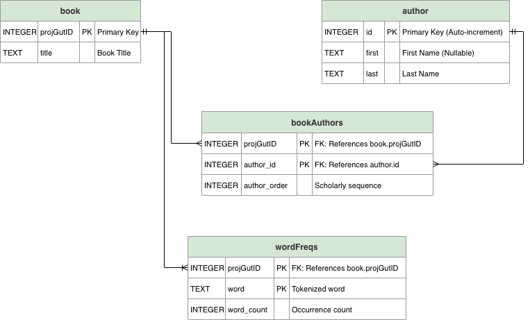

### Implementation Note: Database Location
For the purpose of this demonstration, the `ProjGutBooks.db` file is located within the `/src` directory alongside the application logic. This configuration ensures that the application runs immediately upon download without requiring manual environment setup or path configuration. 

In a production-level environment, standard practice would involve:
1. Moving the database to a dedicated `/data` directory.
2. Utilizing the `pathlib` module for dynamic, cross-platform path resolution. 

This simplified structure was chosen to facilitate ease of use for academic review while maintaining internal technical accuracy.
---

## System Architecture
The application follows a modular, decoupled architecture to ensure that the data processing logic remains independent of the graphical user interface. This separation of concerns allows the helper modules to be reused in standalone scripts, such as the stopword curation utility.

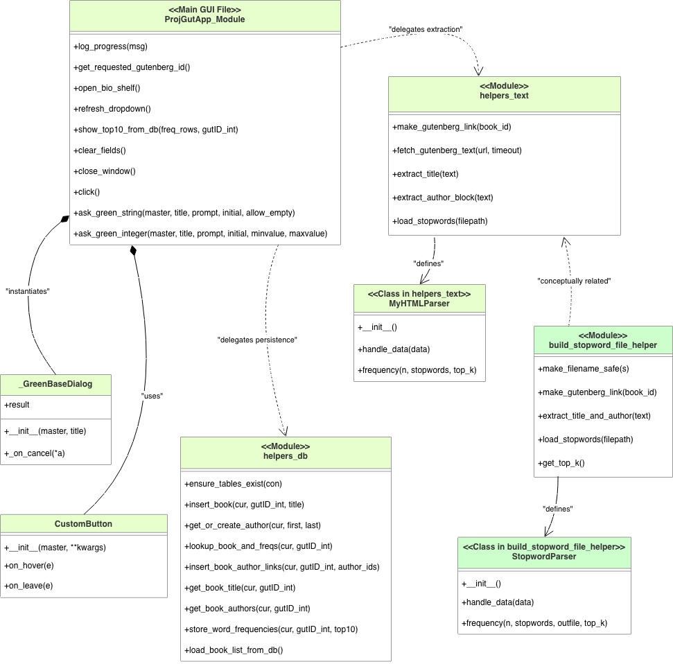

<details>
<summary>Click to view Mermaid.js Source Code</summary>

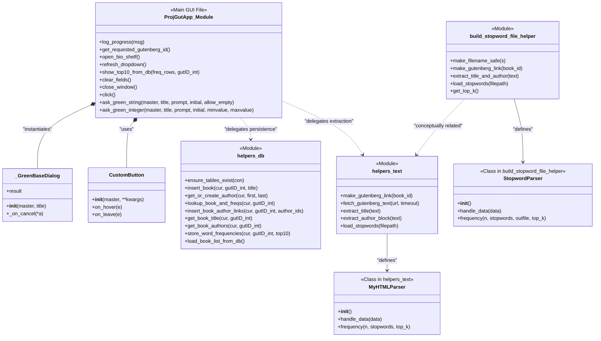

</details>

### Architectural Components:
* **GUI Controller (`ProjGut-gui_main.py`):** Acts as the central orchestrator, managing the Tkinter event loop, themed user dialogs, and coordinating the flow between user input, text extraction, and database persistence.
* **Data Access Layer (`helpers_db.py`):** Encapsulates all SQLite3 operations. It manages the normalized relational schema, atomic transactions, and handles many-to-many relationships between books and authors.
* **Extraction & Parsing (`helpers_text.py`):** Provides stateless utilities for web retrieval and tokenization. It utilizes a custom `HTMLParser` subclass (`MyHTMLParser`) to transform raw web text into analyzed word frequencies.
* **Curation Pipeline (`build_stopword_file_helper.py`):** A standalone CLI utility designed for iterative "noise" reduction. It utilizes its own `StopwordParser` to generate comprehensive TSV reports for manual refinement of the persistent stopword library.
---

## Project Structure
The project is built using a modular layer-based architecture to ensure maintainability:

| File | Role |
| :--- | :--- |
| **`ProjGut-gui_main.py`** | **View & Controller:** Manages the Tkinter event loop, user input validation, and real-time logging of the data pipeline. |
| **`helpers_db.py`** | **Data Access Layer:** Manages the SQLite schema, relational joins, and atomic database transactions. |
| **`helpers_text.py`** | **Logic Layer:** Coordinates HTTP text retrieval, regex/string-based metadata extraction, and the tokenization engine for word frequency counting. |
| **`build_stopword_file_helper.py`** | **Curation Utility:** A standalone CLI script used to analyze specific texts and expand the persistent stopword library. |

---

## Getting Started

### Prerequisites
* Python 3.12+
* Internet Connection (for Gutenberg text retrieval)

### Installation & Setup
1. **Clone and Navigate:**
   ```bash
   git clone https://github.com/krchristie/gutenberg-word-analyzer.git
   cd gutenberg-word-analyzer
   ```
2. **Environment & Dependencies:**
   ```bash
   python -m venv .venv
   source .venv/bin/activate  # Windows: .venv\Scripts\activate
   pip install requests
   ```

---

## Using the App
1. **Selecting existing books:** Books that have already been parsed can be selected from the drop down menu.
2. **Adding new books:**
    * **Find a new book of interest:** Click the "Browse the Project Gutenberg biology shelf for ideas" link to open the Project Gutenberg Biology Shelf
    * **Enter ID:** Enter a specific Project Gutenberg Book ID to fetch a text directly from the web & display Top 10 Interesting Words.
    * **Automatic title detection:** Upon clicking the SUBMIT button, the system utilizes string manipulation to isolate the title from the header, automatically inserting it into the database, and reporting this info in the "Progress Log" results pane.
    * **Manual curation of author info:** As author information is not present in a format that allows automated parsing, the "Extracted Author Block" from the header is displayed in the "Progress Log" results pane to allow manual entry by the user.
        * **Number of Authors:** A pop-up window requests entry of the number of authors of the book.
        * **FIRST & MIDDLE names of Author:** A pop-up window requests entry of the FIRST & MIDDLE name(s) of the first author. Enter 'none' if the author goes by a single name, e.g. Aristotle.
        * **LAST name of Author:** A pop-up window requests entry of the LAST name of the first author. For authors known by a single name, e.g. Aristotle, enter it here.
        * **Multiple Authors:** If there are multiple authors the two Author curation pop-up windows will appear for each author. 
3. **Frequency Analysis:** Once the title and author information is confirmed, the system utilizes a custom `HTMLParser` subclass to tokenize the main body text and compute word frequencies. The system automatically filters these results against stopwords.txt to ensure common "noise" words do not obscure words that are significant in the text of interest.
    * When this analysis is run on a new book, the "Progress Log" results pane displays script progress and the words and frequencies that are loaded into the database.
    * The "Top 10 Interesting Words" results pane displays an ordered list of word frequencies, as retrieved from the database. 
4. **Database Persistence:** Successfully retrieved books and their metadata are stored in the `ProjGutBooks.db` relational database, preventing redundant web requests for future sessions.
5. **Stopword Curation (CLI):** 
    * Run `build_stopword_file_helper.py` in your terminal to analyze a text for high-frequency candidate words to exclude. This utility allows you to manually identify words that are not interesting (e.g. 'a', 'and', 'the', 'while', 'during', etc.) and other words common in these texts (e.g., biological abbreviations like "seq" or "ann") in order to append them to your persistent stopword library. 
    * Note that this script does NOT edit the `stopwords.txt` file.

---

## Exception Handling & Validation
The application includes robust error handling to manage the complexities of live web data and user input:

1. **Network Resilience:** Uses `try-except` blocks to catch `requests.exceptions.RequestException`. If a Book ID is invalid or the server is unreachable, the GUI logs a descriptive error.
2. **Input Integrity:** The system validates Book IDs to ensure they are numeric before initiating a web request, preventing malformed URLs.
3. **Relational Safety:** Database operations are wrapped in atomic transactions to prevent data corruption during the processing phase.
4. **Missing File Tolerance:** The text tokenization engine gracefully handles the absence of `stopwords.txt`. If the file is missing, the application proceeds with an empty stopword set rather than throwing a `FileNotFoundError`, ensuring the application remains functional.
5. **File System Awareness:** The CLI curation utility checks for the existence of the `wordCountFiles` directory and automatically creates it if it does not exist, preventing file path errors when saving the output `.tsv` files.

---

## Screenshots

### Primary Analysis Interface
The opening screen of the Word Frequency Analyzer for Biological Texts of Interest & Historical Significance, showing drop down menu to select a book from the database of analyzed books and the option to enter a Project Gutenberg book ID. There is also a hyperlink to browse the Project Gutenberg Biology shelf and select new books to enter into the database. The interface is designed in a custom green and gray color scheme.
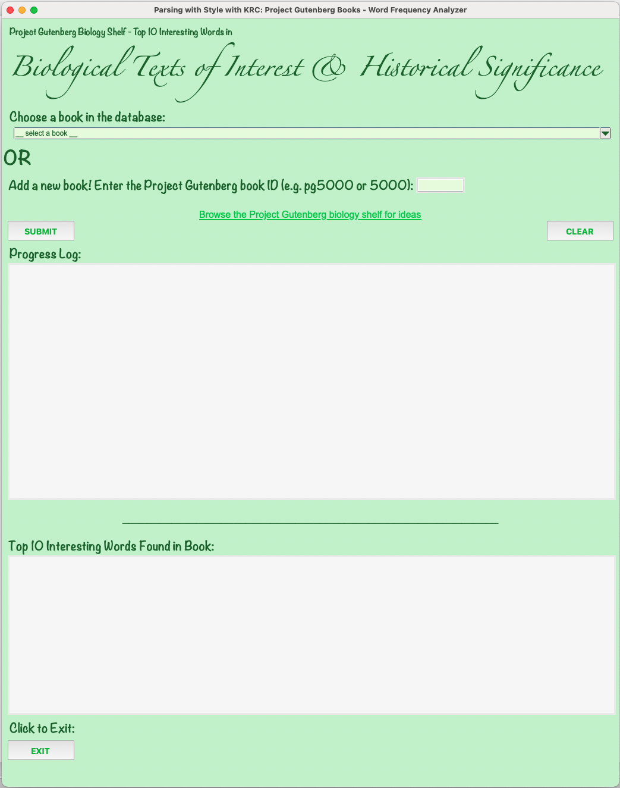

### Drop down menu to select an analyzed book
Books that have already been loaded and parsed for word frequencies can be selected from the drop down menu.
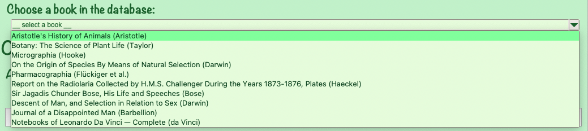

### Progress Log output for a previously analyzed book
When a previously analyzed book is selected from the drop down menu, the Progress Log will indicate that stored word frequencies will be used.
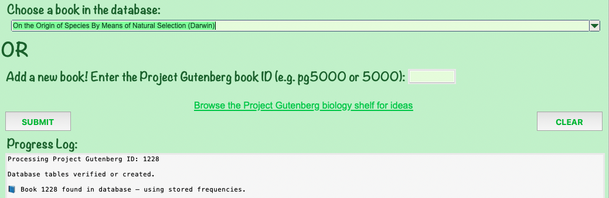

### Exception handling for attempting to enter invalid input for a book ID
If invalid input is submitted via the entry box for entry box for a new book ID, the Progress Log window will display the error and indicate appropriate input format.
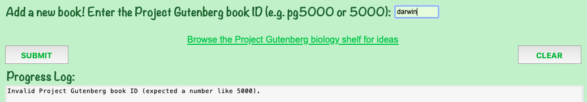

### Entering an ID for a new book & Number of Authors popup menu
When a Project Gutenberg ID for a book not currently in the database is entered into the entry box and the **SUBMIT** button is pressed, the Progress Log will indicate that the title has been detected and a new record has been inserted into the Book table. The Progress Log window will also display the Extracted Author Block. The user can use this information to fill out the Author Information popup windows. The first popup, shown here, asks how many authors does this book have.
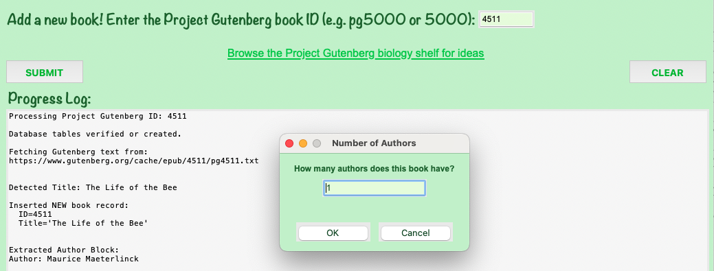

### The Author Names popup windows
If the user entered 2 or a larger number, the next two data entry windows will popup sequentially for each author to be entered.

### Entering First & Middle name(s) of Author popup window
The second author information popup, shown here, asks for the first and middle name(s) of the first author, e.g. "Charles", "Friedrich A.", "Catherine Cooper". This popup window instructs the user to enter "none" for single name authors, e.g. "Aristotle" or "Pliny the Elder".
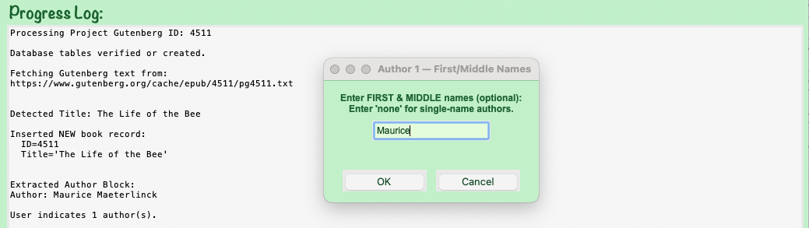

### Entering Last name of Author popup window
The third author information popup, shown here, asks for the last name of the first author, e.g. "Darwin", "Flükiger", "Hopley". This popup window instructs the user to enter the name of single name authors, e.g. "Aristotle" or "Pliny the Elder", in this box.
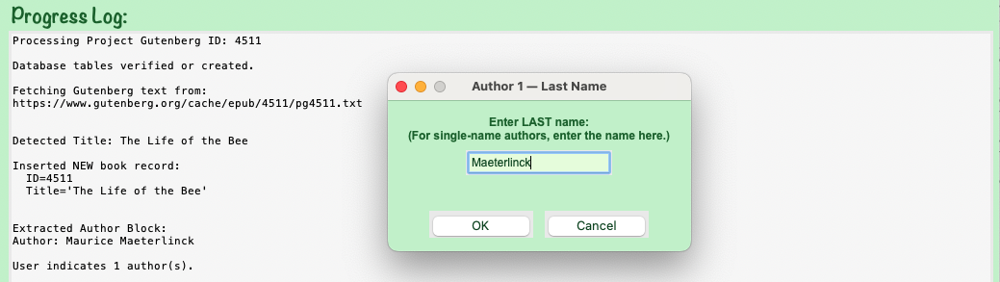

### Progress Log output for a new book
Once all of the author information is entered, the Progress Log window will report the progress of the script and what is added to the database.
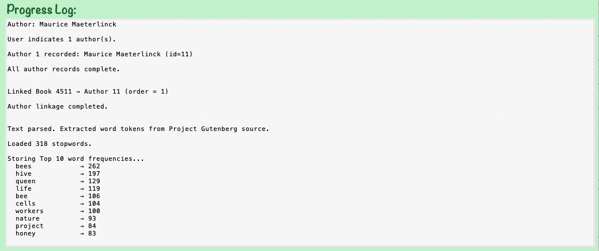

### Top 10 Interesting Words Found in Book display window
This window will display the title of the book, the author(s), and the top 10 most frequent interesting words from the text. The display in this window is the same for books already in the database and newly entered books.
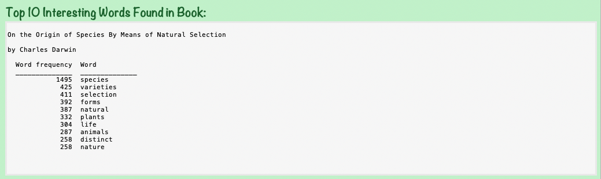

### Curation Utility (CLI) - on screen output
The command-line script for identifying new stopword candidates allows the user to choose to display between 10 and 40 of the top most frequent words not already present in the stopwords.txt file from the text being analyzed. In this case, the 40th word on the list, "iii", is a good candidate to add to the stop words file as this is not a meaningful word.
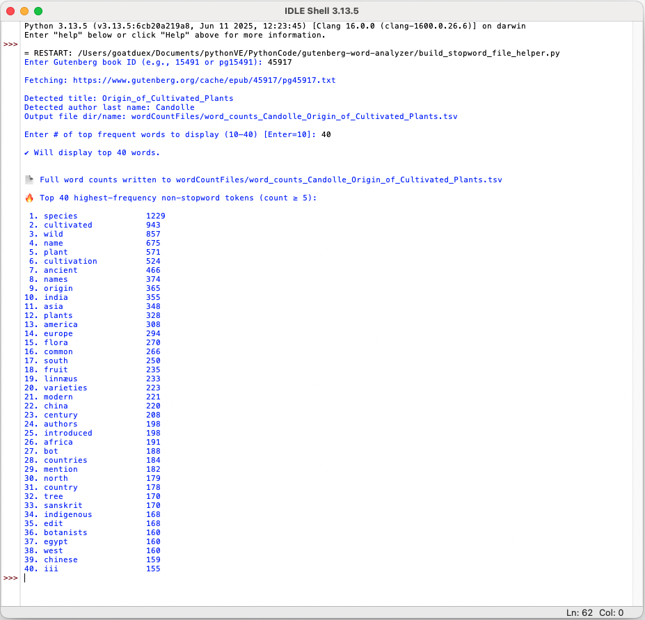

### Curation Utility (CLI) - output file
The command-line script also generates a tab-delimited file of the entire set of word frequencies for the text, named with the author last name and the title of the book, e.g. word_counts_Candolle_Origin_of_Cultivated_Plants.tsv. These are saved to a "wordCountFiles" directory which will be created if it does not already exist.
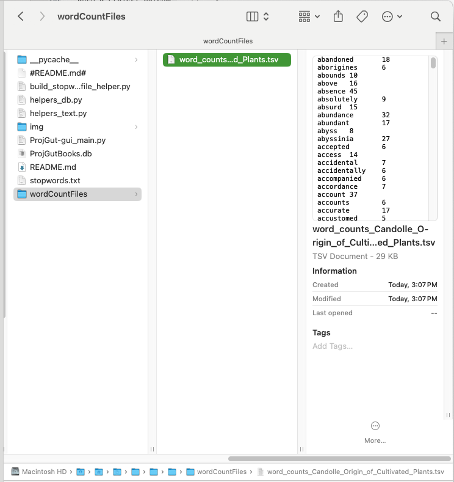

---

## Testing & Generation of the Stop words file
Here is the list of books from the Project Gutenberg Biology shelf used in testing edge cases like multiple authors, single named authors, and multiple books by the same author. These books were also used for the development of the current list of stop words in order to consistently produce a Top 10 Interesting words list that reflects the character of the text analyzed. The number at the beginning of each line is the unique Project Gutenberg ID for that book.
1. **First book added:** 
    * 1228 - On the Origin of Species By Means of Natural Selection   ...   by Charles Darwin
2. **non standard author name order:**
    * 5000 - The Notebooks of Leonardo Da Vinci — Complete   ...   by Leonardo da Vinci
3. **more than 1 author** (2nd author is on a different line without additional header):
    * 67691 - Pharmacographia   ...   by Friedrich A. Flükiger AND Daniel Hanbury
4. **single name authors:**
    * 59058 - Aristotle's History of Animals   ...   by  Aristotle
    * 57493 - The Natural History of Pliny, Volume 1 (of 6)   ...   by the Elder Pliny
5. **multiple books by a single author:**
    * 944 - The Voyage of the Beagle   ...   by Charles Darwin
    * 1227 - The Expression of the Emotions in Man and Animals   ...   by Charles Darwin
    * 2300 - The Descent of Man, and Selection in Relation to Sex   ...   by Charles Darwin
    * 44525 - Report on the Radiolaria Collected by H.M.S. Challenger During the Years 1873-1876, First Part: Porulosa (Spumellaria and Acantharia)   ...   by Ernst Haeckel
    * 44526 - Report on the Radiolaria Collected by H.M.S. Challenger During the Years 1873-1876, Second Part: Subclass Osculosa; Index   ...   by Ernst Haeckel
    * 44527 - Report on the Radiolaria Collected by H.M.S. Challenger During the Years 1873-1876, Plates   ...   by Ernst Haeckel
6. **additional books:**
    * 15491 - Micrographia   ...   by Robert Hooke
    * 20426 - Form and Function: A Contribution to the History of Animal Morphology   ...   by E. S. Russell
    * 20556 - Lamarck, the Founder of Evolution: His Life and Work   ...   by A. S. Packard 
    * 22085 - Sir Jagadis Chunder Bose, His Life and Speeches   ...   by Jagadis Chandra Bose
    * 26492 - Studies of American Fungi. Mushrooms, Edible, Poisonous, etc.   ...   by George Francis Atkinson
    * 30181 - Fungi: Their Nature and Uses   ...   by M. C. Cooke
    * 34450 - The Nature of Animal Light   ...   by E. Newton Harvey
    * 39585 - The Journal of a Disappointed Man   ...   by W. N. P. Barbellion
    * 40505 - Scurvy, Past and Present   ...   by Alfred F. Hess
    * 4511 - The Life of the Bee   ...   by Maurice Maeterlinck
    * 47586 - Everyday Objects; Or, Picturesque Aspects of Natural History.   ...   by W. H. Davenport Adams
    * 49211 - Botany: The Science of Plant Life   ...   by Norman Taylor
    * 53153 - Snakes: Curiosities and Wonders of Serpent Life   ...   by Catherine Cooper Hopley
    * 55264 - On Growth and Form   ...   by D'Arcy Wentworth Thompson
    * 61240 - History of Botany (1530-1860)   ...   by Julius Sachs
    * 63299 - The Book of the Pearl   ...   by George Frederick Kunz
    * 72936 - The life of Jean Henri Fabre, the entomologist, 1823-1910   ...   by Augustin Fabre
